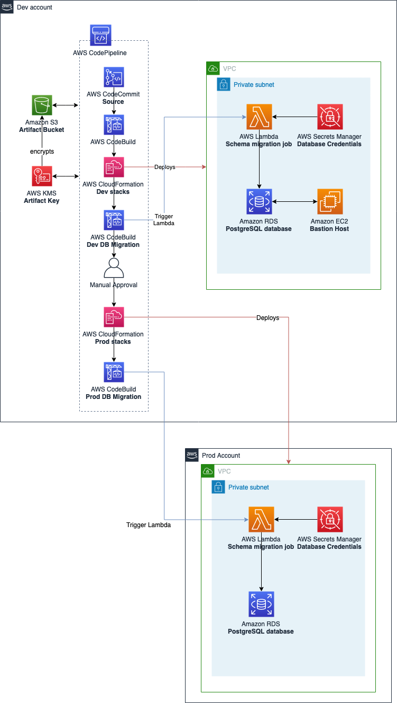
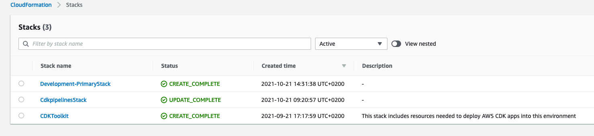

# Integrating Database Schema changes in the CI/CD pipeline. 
Continous delivery strategies are commonly used to increase speed of development and to manage application code changes. However, database changes are often left out of this process and maintained separately, which can become a bottleneck to automated validations as step within CI/CD Pipelines. This project provides an example of how to automate schema changes using AWS Lambda and integrate this step in a CI/CD Pipeline. The solution contains the AWS CDK code for building the infrastructure and the cross-account CI/CD Pipeline.

> In this example we're deploying an Amazon Aurora PostgreSQL-compatible Serverless edition database. However, the same concept can be applied to other supported RDS Engines. 
​
## Solution overview
The CI/CD pipeline is built using the [CDK Pipelines module](https://docs.aws.amazon.com/cdk/api/latest/docs/pipelines-readme.html). The pipeline's source is retrieved from an AWS CodeCommit repository and is triggered upon a push to the default branch. The pipeline contains two stages, the development stage and the production stage. The development stage is configured to deploy resources in the account where the pipeline is deployed. The production stage deployed the resources in another AWS Account. After the resources are deployed / updated, an AWS CodeBuild project is configured to trigger the AWS Lambda function, which runs the schema migrations.
​
​

​
## Prerequisites 
​
* Two AWS accounts.
* [AWS CDK](https://docs.aws.amazon.com/cdk/latest/guide/getting_started.html#getting_started_install) installed.
* [Docker](https://www.docker.com/products/docker-desktop) installed for the initial deploy.
​
## Setup
[Create a new AWS CodeCommit repository](https://docs.aws.amazon.com/codecommit/latest/userguide/how-to-create-repository.html) in the AWS Account and region where you want to deploy the pipeline and upload the source code from this repository. Then, install the npm dependencies: 

```
npm install
```

Bootstrap the development environment: 
​
```
npx cdk bootstrap  \ 
    --profile <DEV PROFILE>  \ 
    --cloudformation-execution-policies arn:aws:iam::aws:policy/AdministratorAccess  \
    aws://<DEV ACCOUNT ID>/<REGION>
```
​
Bootstrap the production environment: 
```
npx cdk bootstrap \                
    --profile <PROD PROFILE> \
    --trust <DEV ACCOUNT ID> \
    --cloudformation-execution-policies arn:aws:iam::aws:policy/AdministratorAccess \
    aws://<PROD ACCOUNT ID>/<REGION>
```
​
Deploy the CI/CD Pipeline: 
​
```
sh ./cdk-deploy-to.sh <DEV ACCOUNT ID> <PROD ACCOUNT ID> <REGION> <REPOSITORY_NAME>
```
​
After this initial deployment, the CI/CD Pipeline will deploy the infrastructure resources. Go to AWS Management Console, CodePipeline service to track the pipeline progress.
​
## Schema migrations with Knex.js
​
[Knex.js](https://knexjs.org/) is a SQL Query Builder library for Node.js compatible with Postgres databases. In addition, Knex offers an easy way to manage
schema migrations by providing CLI commands to easily create and apply migrations using timestamp based migration files. You can learn more about Knex migrations in [their documentaion](https://knexjs.org/#Migrations). 
​
### Creating migration files
The migration file is created inside the *lib/lambda/migrations* directory. The name of the file is composed of the timestamp and the migration name you specify in the command, for example: `20211004160632_CreateInitialDemoTable.ts`. Customize this file with the SQL Queries necessary for the migration. Take a look at the provided file as a reference.

```
npm run migration:make CreateInitialTable
```
​
Below is an example of a migration file. If you wish to only use RDS Native Backup and snapshots, you can leave out the *down* (rollback) specification.

```
const Knex = require("knex");

export async function up(knex: typeof Knex): Promise<void> {
  return await knex.schema.createTable('demo_table', (table: typeof Knex.TableBuilder) => {
    table.increments('id')
  })
}

export async function down(knex: typeof Knex): Promise<void> {
  await knex.schema.dropTable('demo_table')
}
```
​
### Applying migrations 
Migrations are applied using the AWS Lambda functions and are run as part of the CI/CD pipeline after the resources are deployed for both the Development and Production environments. You can view the AWS Lambda function logs and the AWS CodeBuild project logs to check the status of the schema migration.

## Connecting to the RDS Database in the private VPC from a local machine 
​
A Bastion Host is deployed to connect to the development PostgreSQL database from your local machine.
The host is configured to use AWS Session Manager to connect to the instance and than forward the traffic to the database.  
​
1. Install Session Manager plugin for AWS CLI following [these instructions](https://docs.aws.amazon.com/systems-manager/latest/userguide/session-manager-working-with-install-plugin.html).
2. Configure SSH in your local machine by modifying the *~/.ssh/config* file to include the following code:
​
```
# SSH over Session Manager
host i-* mi-*
    ProxyCommand sh -c "aws ssm start-session --target %h --document-name AWS-StartSSHSession --parameters 'portNumber=%p'"
```
​
3. Add your public ssh key to the instance's authorized keys: 
​
```
# grap your public key, typically found in: ~/.ssh/id_rsa.pub
cat ~/.ssh/id_rsa.pub
​
# Connect to the Instance using Session Manager in AWS Console and add the authorized key from above:
sudo su
nano /home/ec2-user/.ssh/authorized_keys
```
​
4. You can now connect to the instance using port forwarding from your local machine:
​
```
ssh -N -L <LOCAL PORT>:<DATABASE HOST NAME>:5432 ec2-user@<BASTION HOST INSTANCE ID>
```

You can now use your preferred SQL Client to connect to the database by using *127.0.0.1* as a hostname and <LOCAL PORT> as port. The database username and password can be retrieved by the AWS Secret Manager secret. 

## Cleanup
Destroy the CDK Pipeline: 

```
sh ./cdk-destroy.sh <DEV ACCOUNT ID> <PROD ACCOUNT ID> <REGION> <REPOSITORY_NAME>
```

The resources created by the pipeline are not destroyed with the above step. You need to go to AWS CloudFormation and delete these stacks manually. For example, below is the stack created by the pipeline for the development environment, named *Development-PrimaryStack*: 



Alternatively, you can use AWS CLI to delete the infrastructure stacks.
Clean the development account resources created by the CI/CD Pipeline: 

```
aws cloudformation delete-stack --stack-name Development-PrimaryStack
```

Clean the production account resources created by the CI/CD Pipeline: 

```
aws cloudformation delete-stack --stack-name Production-PrimaryStack
```

## Security

See [CONTRIBUTING](CONTRIBUTING.md#security-issue-notifications) for more information.

## License

This library is licensed under the MIT-0 License. See the LICENSE file.

